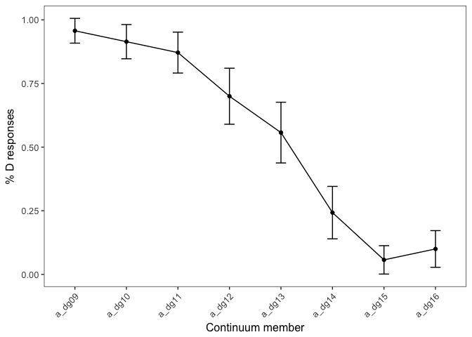
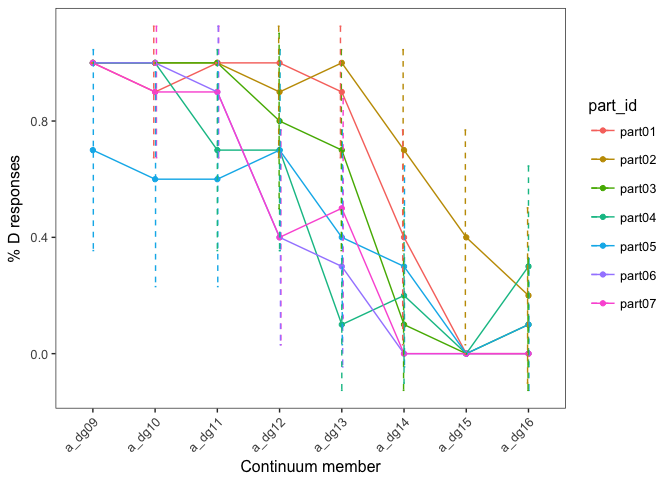
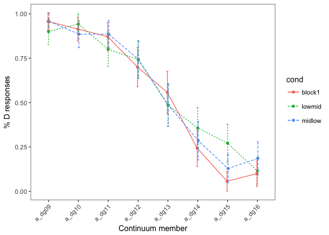
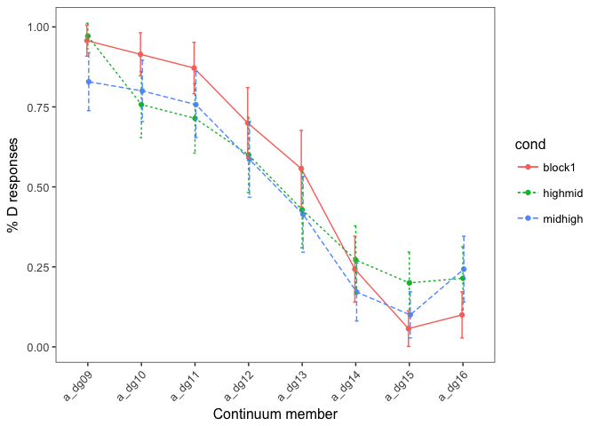
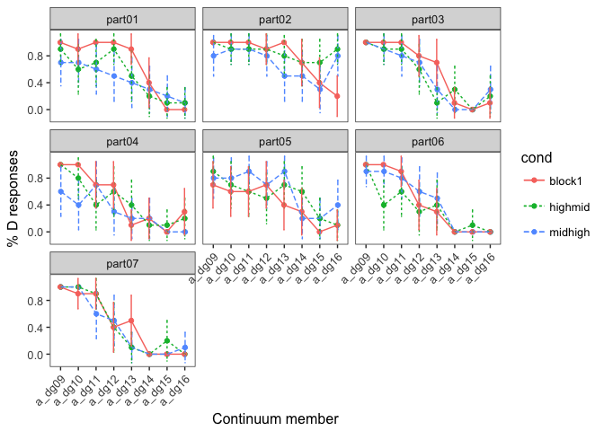

DG precursor exp1
================

### Defining functions

``` r
data_summary <- function(data, varname, groupnames){
  require(plyr)
   length2 <- function (x, na.rm=FALSE) {
        if (na.rm) sum(!is.na(x))
        else       length(x)
    }
  summary_func <- function(x, col){
    c(N    = length2(x[[col]], na.rm=TRUE),
      mean = mean(x[[col]], na.rm=TRUE),
      sd = sd(x[[col]], na.rm=TRUE))
  }
  data_sum<-ddply(data, groupnames, .fun=summary_func,
                  varname)
  data_sum <- rename(data_sum, c("mean" = varname))
  
  data_sum$se <- data_sum$sd / sqrt(data_sum$N)
  
  ciMult <- qt(0.95/2 + .5, data_sum$N-1)
  data_sum$ci <- data_sum$se * ciMult
 return(data_sum)
}

data_summ <- function(data, varname, groupnames){
  require(plyr)
   length2 <- function (x, na.rm=FALSE) {
        if (na.rm) sum(!is.na(x))
        else       length(x)
    }
  summary_func <- function(x, col){
    c(N    = length2(x[[col]], na.rm=TRUE),
      mean = mean(x[[col]], na.rm=TRUE),
      sd = sd(x[[col]], na.rm=TRUE))
  }
  data_sum<-ddply(data, groupnames, .fun=summary_func,
                  varname)
  data_sum <- rename(data_sum, c("mean" = varname))
 return(data_sum)
}
```

### Load in data

``` r
datdir <- '/Users/grushaprasad/Dropbox/Grusha Second Project/psychopy/Exp1/data/'

fname <- 'DGcontext_Exp1'
partnums <- c(1:7)
partnums <- ifelse(partnums < 10, paste("0",as.character(partnums), sep = ""), as.character(partnums))

partids <- paste(fname,"part",partnums, ".csv", sep = "")

all_dat <- NULL

for(part in partids) {
  curr <- read.csv(paste(datdir, part, sep = ""),  header = TRUE)
  curr[6] <- NULL
  all_dat <- rbind(all_dat, curr)
}

all_dat$response_num <- ifelse(all_dat$response == 'D', 1, 0)
all_dat$target_fname <- gsub('./target_stims/', '', all_dat$target_fname)
all_dat$target_fname <- gsub('_CV.wav', '', all_dat$target_fname)

all_dat$coarse <- ifelse(all_dat$cond %in% c('midhigh', 'highmid'), 'high',
                         ifelse(all_dat$cond %in% c('midlow', 'lowmid'), 'low', 'block1'))

all_dat$coarse <- factor(all_dat$coarse)

all_dat$continuum <- as.numeric(regmatches(all_dat$target_fname, gregexpr("[[:digit:]]+", all_dat$target_fname)))

block1 <- subset(all_dat, cond == 'block1')
block2 <- subset(all_dat, cond != 'block1')
```

### Plotting the categorization curves

``` r
by_part <- data_summary(all_dat, 'response_num', .(target_fname, cond, part_id))
```

    ## Loading required package: plyr

``` r
by_filenum <- data_summary(all_dat, 'response_num', .(target_fname, cond))

block1 <- subset(by_filenum, cond %in% c('block1'))
by_part_block1 <- subset(by_part, cond %in% c('block1'))

ggplot(block1,
       aes(target_fname, response_num)) + geom_point(position=position_dodge(0.05)) + geom_line(group=1) + geom_errorbar(aes(ymin=response_num-ci, ymax=response_num+ci), width=.2,position=position_dodge(0.05)) +  labs(x = 'Continuum member', y='% D responses')
```



``` r
ggplot(by_part_block1,
       aes(target_fname, response_num, group = part_id, colour = part_id)) + geom_point() + geom_line() + geom_errorbar(aes(ymin=response_num-ci, ymax=response_num+ci), width=.2,position=position_dodge(0.05), linetype = 2)  + labs(x = 'Continuum member', y='% D responses')
```



### Plotting the shift in curve for the low condition

``` r
ggplot(subset(by_filenum, cond %in% c('block1', 'lowmid', 'midlow')), 
       aes(target_fname, response_num, group = cond, colour = cond,linetype = cond)) + geom_point(position=position_dodge(0.05)) + geom_line(position=position_dodge(0.05)) + geom_errorbar(aes(ymin=response_num-ci, ymax=response_num+ci), width=.2,position=position_dodge(0.05)) + labs(x = 'Continuum member', y='% D responses') 
```



``` r
ggplot(subset(by_part, cond %in% c('block1', 'lowmid', 'midlow')), 
       aes(target_fname, response_num, group = cond, colour = cond, linetype = cond)) + geom_point(position=position_dodge(0.05)) + geom_line(position=position_dodge(0.05)) + geom_errorbar(aes(ymin=response_num-ci, ymax=response_num+ci), width=.2,position=position_dodge(0.05)) + labs(x = 'Continuum member', y='% D responses') + facet_wrap(~part_id, nrow = 3)
```


### Plotting the shift in curve for the high condition

``` r
ggplot(subset(by_filenum, cond %in% c('block1', 'highmid', 'midhigh')), 
       aes(target_fname, response_num, group = cond, colour = cond,linetype = cond)) + geom_point(position=position_dodge(0.05)) + geom_line(position=position_dodge(0.05)) + geom_errorbar(aes(ymin=response_num-ci, ymax=response_num+ci), width=.2,position=position_dodge(0.05)) + labs(x = 'Continuum member', y='% D responses') 
```



``` r
ggplot(subset(by_part, cond %in% c('block1', 'highmid', 'midhigh')), 
       aes(target_fname, response_num, group = cond, colour = cond, linetype = cond)) + geom_point(position=position_dodge(0.05)) + geom_line(position=position_dodge(0.05)) + geom_errorbar(aes(ymin=response_num-ci, ymax=response_num+ci), width=.2,position=position_dodge(0.05)) + labs(x = 'Continuum member', y='% D responses') + facet_wrap(~part_id, nrow = 3)
```



### Coarse analyses

``` r
contrasts(all_dat$coarse)
```

    ##        high low
    ## block1    0   0
    ## high      1   0
    ## low       0   1

``` r
model1 <- glmer(response~scale(continuum)*coarse + (1 + scale(continuum)*coarse| part_id ), data = all_dat,  family = binomial(link = "logit"), glmerControl(optimizer="bobyqa"))

summary(model1)
```

    ## Generalized linear mixed model fit by maximum likelihood (Laplace
    ##   Approximation) [glmerMod]
    ##  Family: binomial  ( logit )
    ## Formula: response ~ scale(continuum) * coarse + (1 + scale(continuum) *  
    ##     coarse | part_id)
    ##    Data: all_dat
    ## Control: glmerControl(optimizer = "bobyqa")
    ## 
    ##      AIC      BIC   logLik deviance df.resid 
    ##   2463.0   2623.3  -1204.5   2409.0     2773 
    ## 
    ## Scaled residuals: 
    ##      Min       1Q   Median       3Q      Max 
    ## -10.5457  -0.4869  -0.1070   0.4921  12.9360 
    ## 
    ## Random effects:
    ##  Groups  Name                        Variance Std.Dev. Corr             
    ##  part_id (Intercept)                 1.3719   1.1713                    
    ##          scale(continuum)            0.7788   0.8825   -0.35            
    ##          coarsehigh                  0.6515   0.8071   -0.84  0.68      
    ##          coarselow                   0.5840   0.7642   -0.71  0.62  0.97
    ##          scale(continuum):coarsehigh 0.5827   0.7634    0.90 -0.68 -0.98
    ##          scale(continuum):coarselow  0.6736   0.8207    0.85 -0.47 -0.96
    ##             
    ##             
    ##             
    ##             
    ##             
    ##  -0.91      
    ##  -0.97  0.93
    ## Number of obs: 2800, groups:  part_id, 7
    ## 
    ## Fixed effects:
    ##                             Estimate Std. Error z value Pr(>|z|)    
    ## (Intercept)                  -0.6106     0.4737  -1.289  0.19744    
    ## scale(continuum)              2.7830     0.4150   6.707 1.99e-11 ***
    ## coarsehigh                    0.6873     0.3572   1.924  0.05429 .  
    ## coarselow                     0.1252     0.3471   0.361  0.71819    
    ## scale(continuum):coarsehigh  -1.2595     0.3925  -3.209  0.00133 ** 
    ## scale(continuum):coarselow   -0.7026     0.4188  -1.678  0.09341 .  
    ## ---
    ## Signif. codes:  0 '***' 0.001 '**' 0.01 '*' 0.05 '.' 0.1 ' ' 1
    ## 
    ## Correlation of Fixed Effects:
    ##                 (Intr) scl(c) crshgh corslw scl(cntnm):crsh
    ## scal(cntnm)     -0.338                                     
    ## coarsehigh      -0.835  0.570                              
    ## coarselow       -0.726  0.519  0.915                       
    ## scl(cntnm):crsh  0.701 -0.776 -0.719 -0.666                
    ## scl(cntnm):crsl  0.663 -0.628 -0.711 -0.719  0.877

### Comparing highmid with midhigh

``` r
high <- subset(all_dat, coarse != 'low')
high$cond <- factor(high$cond, levels = c('midhigh', 'highmid', 'block1'))
contrasts(high$cond)
```

    ##         highmid block1
    ## midhigh       0      0
    ## highmid       1      0
    ## block1        0      1

``` r
model2 <- glmer(response~scale(continuum)*cond + (1 + scale(continuum)*coarse| part_id ), data = high,  family = binomial(link = "logit"), glmerControl(optimizer="bobyqa"))

summary(model2)
```

    ## Generalized linear mixed model fit by maximum likelihood (Laplace
    ##   Approximation) [glmerMod]
    ##  Family: binomial  ( logit )
    ## Formula: response ~ scale(continuum) * cond + (1 + scale(continuum) *  
    ##     coarse | part_id)
    ##    Data: high
    ## Control: glmerControl(optimizer = "bobyqa")
    ## 
    ##      AIC      BIC   logLik deviance df.resid 
    ##   1533.4   1620.2   -750.7   1501.4     1664 
    ## 
    ## Scaled residuals: 
    ##     Min      1Q  Median      3Q     Max 
    ## -9.6619 -0.5213 -0.0655  0.5123 13.1459 
    ## 
    ## Random effects:
    ##  Groups  Name                        Variance Std.Dev. Corr             
    ##  part_id (Intercept)                 1.3540   1.1636                    
    ##          scale(continuum)            0.7802   0.8833   -0.32            
    ##          coarsehigh                  0.6539   0.8086   -0.83  0.68      
    ##          scale(continuum):coarsehigh 0.5891   0.7675    0.89 -0.68 -0.98
    ## Number of obs: 1680, groups:  part_id, 7
    ## 
    ## Fixed effects:
    ##                               Estimate Std. Error z value Pr(>|z|)    
    ## (Intercept)                   0.189914   0.273233   0.695  0.48702    
    ## scale(continuum)              1.521441   0.284125   5.355 8.56e-08 ***
    ## condhighmid                  -0.202944   0.149903  -1.354  0.17579    
    ## condblock1                   -0.789912   0.364493  -2.167  0.03022 *  
    ## scale(continuum):condhighmid  0.002951   0.173265   0.017  0.98641    
    ## scale(continuum):condblock1   1.260173   0.402165   3.133  0.00173 ** 
    ## ---
    ## Signif. codes:  0 '***' 0.001 '**' 0.01 '*' 0.05 '.' 0.1 ' ' 1
    ## 
    ## Correlation of Fixed Effects:
    ##             (Intr) scl(c) cndhgh cndbl1 scl():
    ## scal(cntnm)  0.668                            
    ## condhighmid -0.275 -0.028                     
    ## condblock1   0.069  0.154  0.206              
    ## scl(cntnm): -0.023 -0.302  0.043  0.017       
    ## scl(cntn):1 -0.265 -0.309  0.020 -0.681  0.214

### Comparing lowmid with midlow

``` r
low <- subset(all_dat, coarse != 'high')
low$cond <- factor(low$cond, levels = c('lowmid', 'midlow', 'block1'))
contrasts(low$cond)
```

    ##        midlow block1
    ## lowmid      0      0
    ## midlow      1      0
    ## block1      0      1

``` r
model3 <- glmer(response~scale(continuum)*cond + (1 + scale(continuum)*coarse| part_id ), data = low,  family = binomial(link = "logit"), glmerControl(optimizer="bobyqa"))

summary(model3)
```

    ## Generalized linear mixed model fit by maximum likelihood (Laplace
    ##   Approximation) [glmerMod]
    ##  Family: binomial  ( logit )
    ## Formula: response ~ scale(continuum) * cond + (1 + scale(continuum) *  
    ##     coarse | part_id)
    ##    Data: low
    ## Control: glmerControl(optimizer = "bobyqa")
    ## 
    ##      AIC      BIC   logLik deviance df.resid 
    ##   1360.2   1447.0   -664.1   1328.2     1664 
    ## 
    ## Scaled residuals: 
    ##      Min       1Q   Median       3Q      Max 
    ## -11.4044  -0.4319  -0.1090   0.3972  11.8720 
    ## 
    ## Random effects:
    ##  Groups  Name                       Variance Std.Dev. Corr             
    ##  part_id (Intercept)                1.3752   1.1727                    
    ##          scale(continuum)           0.8099   0.8999   -0.37            
    ##          coarselow                  0.5737   0.7574   -0.70  0.64      
    ##          scale(continuum):coarselow 0.6448   0.8030    0.84 -0.52 -0.97
    ## Number of obs: 1680, groups:  part_id, 7
    ## 
    ## Fixed effects:
    ##                             Estimate Std. Error z value Pr(>|z|)    
    ## (Intercept)                 -0.50203    0.34270  -1.465   0.1429    
    ## scale(continuum)             1.94442    0.35754   5.438 5.38e-08 ***
    ## condmidlow                   0.01787    0.16802   0.106   0.9153    
    ## condblock1                  -0.11635    0.35420  -0.328   0.7426    
    ## scale(continuum):condmidlow  0.25106    0.20607   1.218   0.2231    
    ## scale(continuum):condblock1  0.84216    0.42326   1.990   0.0466 *  
    ## ---
    ## Signif. codes:  0 '***' 0.001 '**' 0.01 '*' 0.05 '.' 0.1 ' ' 1
    ## 
    ## Correlation of Fixed Effects:
    ##             (Intr) scl(c) cndmdl cndbl1 scl():
    ## scal(cntnm)  0.256                            
    ## condmidlow  -0.235  0.047                     
    ## condblock1  -0.075  0.203  0.227              
    ## scl(cntnm):  0.040 -0.262 -0.179 -0.039       
    ## scl(cntn):1 -0.171 -0.431 -0.040 -0.691  0.221
