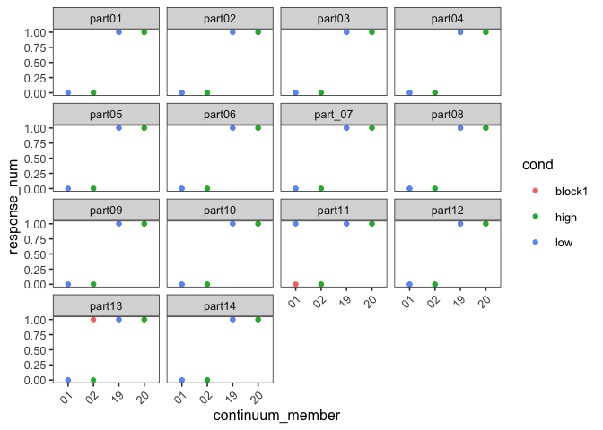
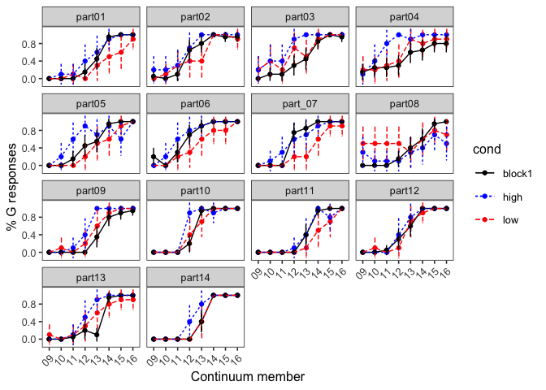

Exp 2
================

### Defining functions

``` r
# data_summary <- function(data, varname, groupnames, ci = TRUE){
#   require(plyr)
#    length2 <- function (x, na.rm=FALSE) {
#         if (na.rm) sum(!is.na(x))
#         else       length(x)
#     }
# 
#   data_sum <- data %>% group_by(.dots = groupnames) %>% summarise(N = length2(get(varname)), get(varname)) = mean(get(varname), na.rm = TRUE), sd = sd(get(varname), na.rm = TRUE)) %>% rename(!!varname := mean)
#   
#   if(ci==FALSE){
#     return(data_sum)
#   }
#   else{
#     data_sum$se <- data_sum$sd / sqrt(data_sum$N)
# 
#   ciMult <- qt(0.95/2 + .5, data_sum$N-1)
#   data_sum$ci <- data_sum$se * ciMult
#  return(data_sum)
#   }
# }

data_summary <- function(data, varname, groupnames){
  require(plyr)
   length2 <- function (x, na.rm=FALSE) {
        if (na.rm) sum(!is.na(x))
        else       length(x)
    }
  summary_func <- function(x, col){
    c(N    = length2(x[[col]], na.rm=TRUE),
      mean = mean(x[[col]], na.rm=TRUE),
      sd = sd(x[[col]], na.rm=TRUE))
  }
  data_sum<-ddply(data, groupnames, .fun=summary_func,
                  varname)
  data_sum <- rename(data_sum, c("mean" = varname))

  data_sum$se <- data_sum$sd / sqrt(data_sum$N)

  ciMult <- qt(0.95/2 + .5, data_sum$N-1)
  data_sum$ci <- data_sum$se * ciMult
 return(data_sum)
}
```

### Load in data

``` r
datdir <- '../data/'

practice_members = c('01', '02', '19', '20')

fname <- 'DGcontext_Exp2'
partnums <- c(1:14)
partnums <- ifelse(partnums < 10, paste("0",as.character(partnums), sep = ""), as.character(partnums))

partids <- paste(fname,"part",partnums, ".csv", sep = "")

all_dat <- NULL

for(part in partids) {
  curr <- read.csv(paste(datdir, part, sep = ""),  header = TRUE)
  all_dat <- rbind(all_dat, curr)
}
rm(curr)

all_dat$response_num <- ifelse(all_dat$response == 'G', 1, 0)
all_dat$continuum_member <-gsub("[^0-9]", "",  all_dat$target_fname)

exp_dat <- subset(all_dat, !(continuum_member %in% practice_members))
practice_dat <- subset(all_dat, continuum_member %in% practice_members)
practice_dat$cond <- ifelse(grepl('high', practice_dat$target_fname), 'high',
                            ifelse(grepl('low', practice_dat$target_fname), 'low', 'block1'))
```

### Looking at practice trials

``` r
ggplot(practice_dat, aes(continuum_member, response_num, colour = cond)) + geom_point() + facet_wrap(~part_id)
```

 Participants 11 and 13 look weird. Maybe exclude them?

``` r
block1_summ <- data_summary(subset(exp_dat, cond == 'block1'), 'response_num', .(continuum_member))
```

    ## Loading required package: plyr

    ## -------------------------------------------------------------------------

    ## You have loaded plyr after dplyr - this is likely to cause problems.
    ## If you need functions from both plyr and dplyr, please load plyr first, then dplyr:
    ## library(plyr); library(dplyr)

    ## -------------------------------------------------------------------------

    ## 
    ## Attaching package: 'plyr'

    ## The following objects are masked from 'package:dplyr':
    ## 
    ##     arrange, count, desc, failwith, id, mutate, rename, summarise,
    ##     summarize

    ## The following object is masked from 'package:purrr':
    ## 
    ##     compact

``` r
block1_summ_bypart <- data_summary(subset(exp_dat, cond == 'block1'), 'response_num', .(continuum_member, part_id))

ggplot(block1_summ,
       aes(continuum_member, response_num)) + geom_point(position=position_dodge(0.05)) + geom_line(group=1) + geom_errorbar(aes(ymin=response_num-ci, ymax=response_num+ci), width=.2,position=position_dodge(0.05)) +  labs(x = 'Continuum member', y='% G responses')
```


``` r
ggplot(block1_summ_bypart,
       aes(continuum_member, response_num)) + geom_point(position=position_dodge(0.05)) + geom_line(group=1) + geom_errorbar(aes(ymin=response_num-ci, ymax=response_num+ci), width=.2,position=position_dodge(0.05)) +  labs(x = 'Continuum member', y='% G responses') + facet_wrap(~part_id)
```


``` r
block2_summ <- data_summary(exp_dat, 'response_num', .(continuum_member, cond))
block2_summ_bypart <- data_summary(subset(exp_dat, cond != 'block2'), 'response_num', .(continuum_member, cond, part_id))

ggplot(block2_summ,
       aes(continuum_member, response_num, colour = cond, group = cond, linetype = cond)) + geom_point(position=position_dodge(0.05)) + geom_line() + geom_errorbar(aes(ymin=response_num-ci, ymax=response_num+ci), width=.2,position=position_dodge(0.05)) +  labs(x = 'Continuum member', y='% G responses') + scale_colour_manual(values = c('black', 'blue', 'red'))
```


``` r
ggplot(block2_summ_bypart,
       aes(continuum_member, response_num, colour = cond, group = cond, linetype = cond)) + geom_point(position=position_dodge(0.05)) + geom_line() + geom_errorbar(aes(ymin=response_num-ci, ymax=response_num+ci), width=.2,position=position_dodge(0.05)) +  labs(x = 'Continuum member', y='% G responses') + facet_wrap(~part_id) + scale_colour_manual(values = c('black', 'blue', 'red'))
```



``` r
# Exlcuding 11 and 13


block2_summ <- data_summary(subset(exp_dat, !(part_id %in% c('part11', 'part13'))) , 'response_num', .(continuum_member, cond))

ggplot(block2_summ,
       aes(continuum_member, response_num, colour = cond, group = cond, linetype = cond)) + geom_point(position=position_dodge(0.05)) + geom_line() + geom_errorbar(aes(ymin=response_num-ci, ymax=response_num+ci), width=.2,position=position_dodge(0.05)) +  labs(x = 'Continuum member', y='% G responses') + scale_colour_manual(values = c('black', 'blue', 'red'))
```


### Statistical analyses

``` r
exp_dat$continuum_member <- as.integer(exp_dat$continuum_member)
contrasts(exp_dat$cond)
```

    ##        high low
    ## block1    0   0
    ## high      1   0
    ## low       0   1

``` r
model1 <- glmer(response_num~scale(continuum_member)*cond + (1 + scale(continuum_member)*cond | part_id ), data = exp_dat,  family = binomial(link = "logit"), glmerControl(optimizer="bobyqa"))
```

    ## boundary (singular) fit: see ?isSingular

``` r
summary(model1)
```

    ## Generalized linear mixed model fit by maximum likelihood (Laplace
    ##   Approximation) [glmerMod]
    ##  Family: binomial  ( logit )
    ## Formula: 
    ## response_num ~ scale(continuum_member) * cond + (1 + scale(continuum_member) *  
    ##     cond | part_id)
    ##    Data: exp_dat
    ## Control: glmerControl(optimizer = "bobyqa")
    ## 
    ##      AIC      BIC   logLik deviance df.resid 
    ##   2685.1   2858.1  -1315.6   2631.1     4453 
    ## 
    ## Scaled residuals: 
    ##      Min       1Q   Median       3Q      Max 
    ## -20.0816  -0.2532  -0.0010   0.2582   9.1430 
    ## 
    ## Random effects:
    ##  Groups  Name                             Variance Std.Dev. Corr       
    ##  part_id (Intercept)                      1.325    1.151               
    ##          scale(continuum_member)          3.667    1.915    -0.48      
    ##          condhigh                         1.102    1.050    -0.47 -0.11
    ##          condlow                          1.550    1.245    -0.74 -0.10
    ##          scale(continuum_member):condhigh 2.377    1.542     0.22 -0.47
    ##          scale(continuum_member):condlow  1.580    1.257     0.64 -0.77
    ##                   
    ##                   
    ##                   
    ##                   
    ##   0.73            
    ##   0.76  0.26      
    ##   0.33 -0.12  0.84
    ## Number of obs: 4480, groups:  part_id, 14
    ## 
    ## Fixed effects:
    ##                                  Estimate Std. Error z value Pr(>|z|)    
    ## (Intercept)                      -0.47751    0.32381  -1.475    0.140    
    ## scale(continuum_member)           4.59347    0.57302   8.016 1.09e-15 ***
    ## condhigh                          1.47169    0.32732   4.496 6.92e-06 ***
    ## condlow                          -0.08356    0.36409  -0.229    0.818    
    ## scale(continuum_member):condhigh -0.87737    0.55597  -1.578    0.115    
    ## scale(continuum_member):condlow  -1.79583    0.45781  -3.923 8.76e-05 ***
    ## ---
    ## Signif. codes:  0 '***' 0.001 '**' 0.01 '*' 0.05 '.' 0.1 ' ' 1
    ## 
    ## Correlation of Fixed Effects:
    ##                      (Intr) scl(_) cndhgh condlw scl(cntnm_mmbr):cndh
    ## scl(cntnm_)          -0.456                                          
    ## condhigh             -0.477 -0.038                                   
    ## condlow              -0.726 -0.039  0.655                            
    ## scl(cntnm_mmbr):cndh  0.200 -0.519  0.532  0.138                     
    ## scl(cntnm_mmbr):cndl  0.507 -0.750  0.158 -0.169  0.716              
    ## convergence code: 0
    ## boundary (singular) fit: see ?isSingular

``` r
# Simpler random effect structure
model1.2 <- glmer(response_num~scale(continuum_member)*cond + (1 + cond | part_id ), data = exp_dat,  family = binomial(link = "logit"), glmerControl(optimizer="bobyqa"))

summary(model1.2)
```

    ## Generalized linear mixed model fit by maximum likelihood (Laplace
    ##   Approximation) [glmerMod]
    ##  Family: binomial  ( logit )
    ## Formula: 
    ## response_num ~ scale(continuum_member) * cond + (1 + cond | part_id)
    ##    Data: exp_dat
    ## Control: glmerControl(optimizer = "bobyqa")
    ## 
    ##      AIC      BIC   logLik deviance df.resid 
    ##   2922.8   2999.7  -1449.4   2898.8     4468 
    ## 
    ## Scaled residuals: 
    ##      Min       1Q   Median       3Q      Max 
    ## -18.5994  -0.3049  -0.0366   0.3064  17.1863 
    ## 
    ## Random effects:
    ##  Groups  Name        Variance Std.Dev. Corr       
    ##  part_id (Intercept) 0.6991   0.8361              
    ##          condhigh    0.8429   0.9181   -0.18      
    ##          condlow     1.1609   1.0775   -0.77  0.53
    ## Number of obs: 4480, groups:  part_id, 14
    ## 
    ## Fixed effects:
    ##                                  Estimate Std. Error z value Pr(>|z|)    
    ## (Intercept)                      -0.25084    0.23531  -1.066 0.286423    
    ## scale(continuum_member)           3.40416    0.14409  23.625  < 2e-16 ***
    ## condhigh                          1.01502    0.27605   3.677 0.000236 ***
    ## condlow                          -0.09498    0.30952  -0.307 0.758962    
    ## scale(continuum_member):condhigh -0.63030    0.21766  -2.896 0.003782 ** 
    ## scale(continuum_member):condlow  -1.21609    0.18995  -6.402 1.53e-10 ***
    ## ---
    ## Signif. codes:  0 '***' 0.001 '**' 0.01 '*' 0.05 '.' 0.1 ' ' 1
    ## 
    ## Correlation of Fixed Effects:
    ##                      (Intr) scl(_) cndhgh condlw scl(cntnm_mmbr):cndh
    ## scl(cntnm_)          -0.044                                          
    ## condhigh             -0.237  0.037                                   
    ## condlow              -0.756  0.033  0.503                            
    ## scl(cntnm_mmbr):cndh  0.029 -0.662  0.084 -0.022                     
    ## scl(cntnm_mmbr):cndl  0.033 -0.759 -0.028 -0.059  0.502
