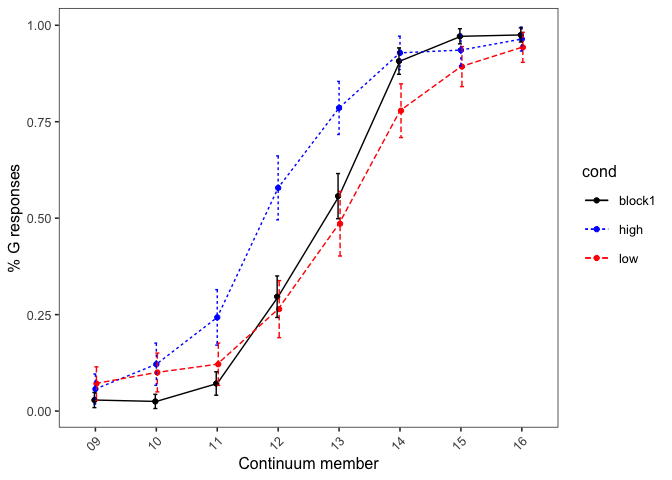

Exp 2
================

### Defining functions

``` r
# data_summary <- function(data, varname, groupnames, ci = TRUE){
#   require(plyr)
#    length2 <- function (x, na.rm=FALSE) {
#         if (na.rm) sum(!is.na(x))
#         else       length(x)
#     }
# 
#   data_sum <- data %>% group_by(.dots = groupnames) %>% summarise(N = length2(get(varname)), get(varname)) = mean(get(varname), na.rm = TRUE), sd = sd(get(varname), na.rm = TRUE)) %>% rename(!!varname := mean)
#   
#   if(ci==FALSE){
#     return(data_sum)
#   }
#   else{
#     data_sum$se <- data_sum$sd / sqrt(data_sum$N)
# 
#   ciMult <- qt(0.95/2 + .5, data_sum$N-1)
#   data_sum$ci <- data_sum$se * ciMult
#  return(data_sum)
#   }
# }

data_summary <- function(data, varname, groupnames){
  require(plyr)
   length2 <- function (x, na.rm=FALSE) {
        if (na.rm) sum(!is.na(x))
        else       length(x)
    }
  summary_func <- function(x, col){
    c(N    = length2(x[[col]], na.rm=TRUE),
      mean = mean(x[[col]], na.rm=TRUE),
      sd = sd(x[[col]], na.rm=TRUE))
  }
  data_sum<-ddply(data, groupnames, .fun=summary_func,
                  varname)
  data_sum <- rename(data_sum, c("mean" = varname))

  data_sum$se <- data_sum$sd / sqrt(data_sum$N)

  ciMult <- qt(0.95/2 + .5, data_sum$N-1)
  data_sum$ci <- data_sum$se * ciMult
 return(data_sum)
}
```

### Load in data

``` r
datdir <- '../data/'

practice_members = c('01', '02', '19', '20')

fname <- 'DGcontext_Exp2'
partnums <- c(1:6)
partnums <- ifelse(partnums < 10, paste("0",as.character(partnums), sep = ""), as.character(partnums))

partids <- paste(fname,"part",partnums, ".csv", sep = "")

all_dat <- NULL

for(part in partids) {
  curr <- read.csv(paste(datdir, part, sep = ""),  header = TRUE)
  all_dat <- rbind(all_dat, curr)
}
rm(curr)

all_dat$response_num <- ifelse(all_dat$response == 'G', 1, 0)
all_dat$continuum_member <-gsub("[^0-9]", "",  all_dat$target_fname)

exp_dat <- subset(all_dat, !(continuum_member %in% practice_members))
practice_dat <- subset(all_dat, continuum_member %in% practice_members)
practice_dat$cond <- ifelse(grepl('high', practice_dat$target_fname), 'high',
                            ifelse(grepl('low', practice_dat$target_fname), 'low', 'block1'))
```

### Looking at practice trials

``` r
ggplot(practice_dat, aes(continuum_member, response_num, colour = cond)) + geom_point() + facet_wrap(~part_id)
```


``` r
block1_summ <- data_summary(subset(exp_dat, cond == 'block1'), 'response_num', .(continuum_member))
```

    ## Loading required package: plyr

    ## -------------------------------------------------------------------------

    ## You have loaded plyr after dplyr - this is likely to cause problems.
    ## If you need functions from both plyr and dplyr, please load plyr first, then dplyr:
    ## library(plyr); library(dplyr)

    ## -------------------------------------------------------------------------

    ## 
    ## Attaching package: 'plyr'

    ## The following objects are masked from 'package:dplyr':
    ## 
    ##     arrange, count, desc, failwith, id, mutate, rename, summarise,
    ##     summarize

    ## The following object is masked from 'package:purrr':
    ## 
    ##     compact

``` r
block1_summ_bypart <- data_summary(subset(exp_dat, cond == 'block1'), 'response_num', .(continuum_member, part_id))

ggplot(block1_summ,
       aes(continuum_member, response_num)) + geom_point(position=position_dodge(0.05)) + geom_line(group=1) + geom_errorbar(aes(ymin=response_num-ci, ymax=response_num+ci), width=.2,position=position_dodge(0.05)) +  labs(x = 'Continuum member', y='% G responses')
```


``` r
ggplot(block1_summ_bypart,
       aes(continuum_member, response_num)) + geom_point(position=position_dodge(0.05)) + geom_line(group=1) + geom_errorbar(aes(ymin=response_num-ci, ymax=response_num+ci), width=.2,position=position_dodge(0.05)) +  labs(x = 'Continuum member', y='% G responses') + facet_wrap(~part_id)
```


``` r
block2_summ <- data_summary(exp_dat, 'response_num', .(continuum_member, cond))
block2_summ_bypart <- data_summary(subset(exp_dat, cond != 'block2'), 'response_num', .(continuum_member, cond, part_id))

ggplot(block2_summ,
       aes(continuum_member, response_num, colour = cond, group = cond, linetype = cond)) + geom_point(position=position_dodge(0.05)) + geom_line() + geom_errorbar(aes(ymin=response_num-ci, ymax=response_num+ci), width=.2,position=position_dodge(0.05)) +  labs(x = 'Continuum member', y='% G responses') + scale_colour_manual(values = c('black', 'blue', 'red'))
```



``` r
ggplot(block2_summ_bypart,
       aes(continuum_member, response_num, colour = cond, group = cond, linetype = cond)) + geom_point(position=position_dodge(0.05)) + geom_line() + geom_errorbar(aes(ymin=response_num-ci, ymax=response_num+ci), width=.2,position=position_dodge(0.05)) +  labs(x = 'Continuum member', y='% G responses') + facet_wrap(~part_id) + scale_colour_manual(values = c('black', 'blue', 'red'))
```


